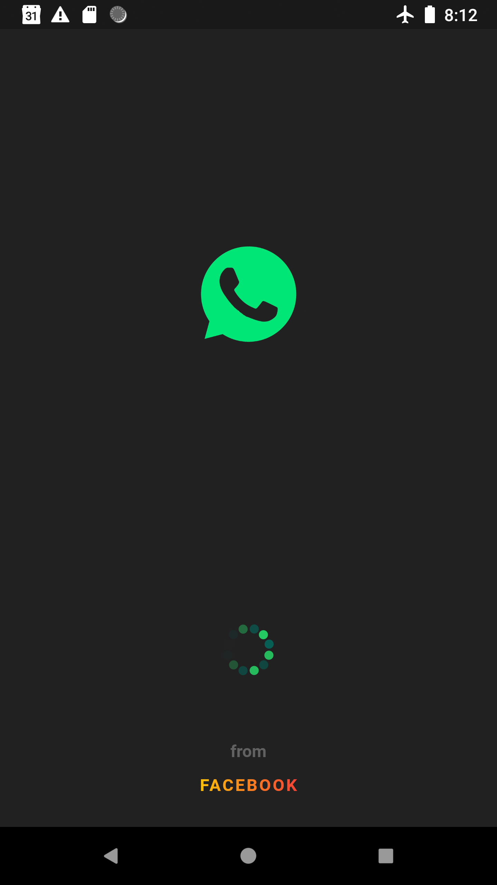
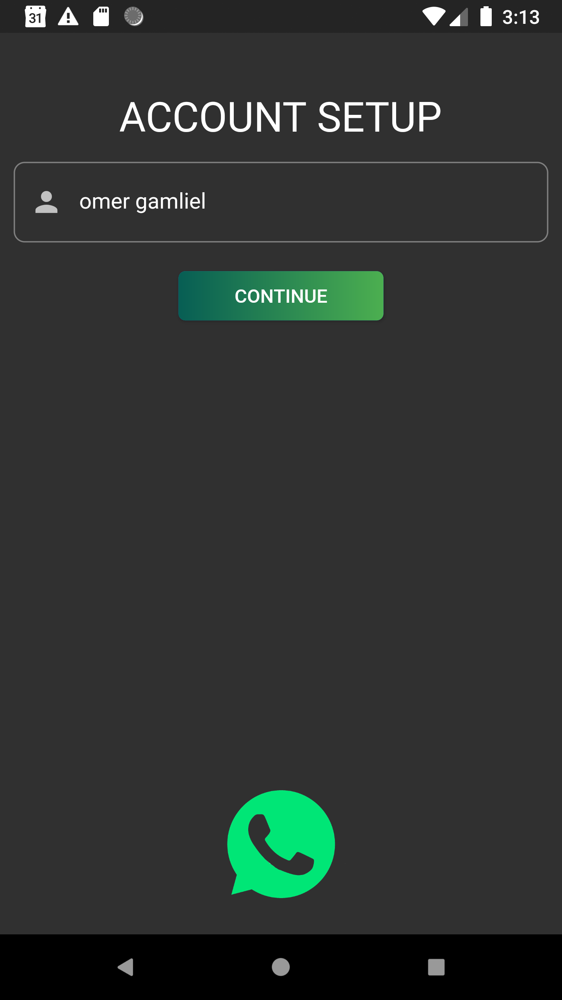
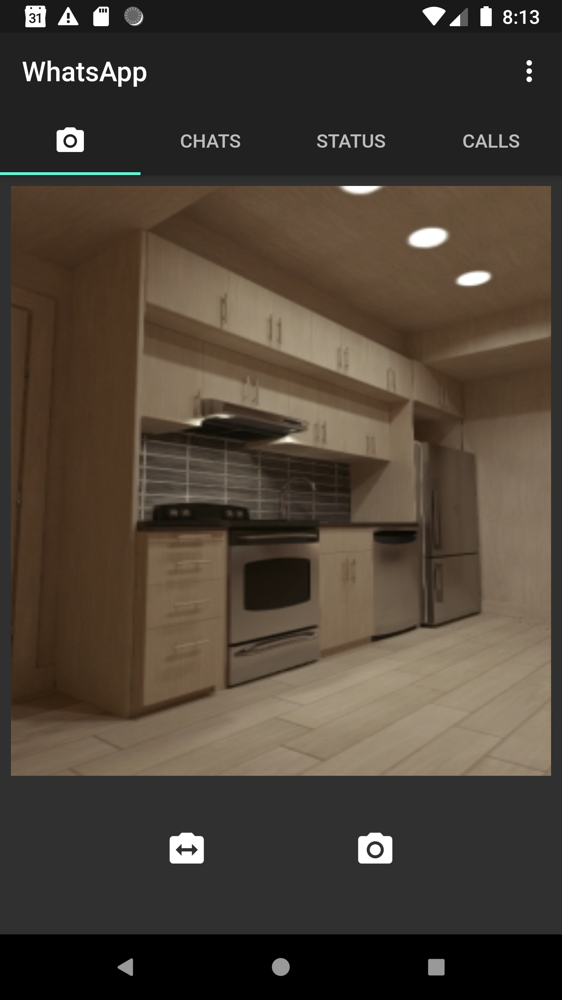
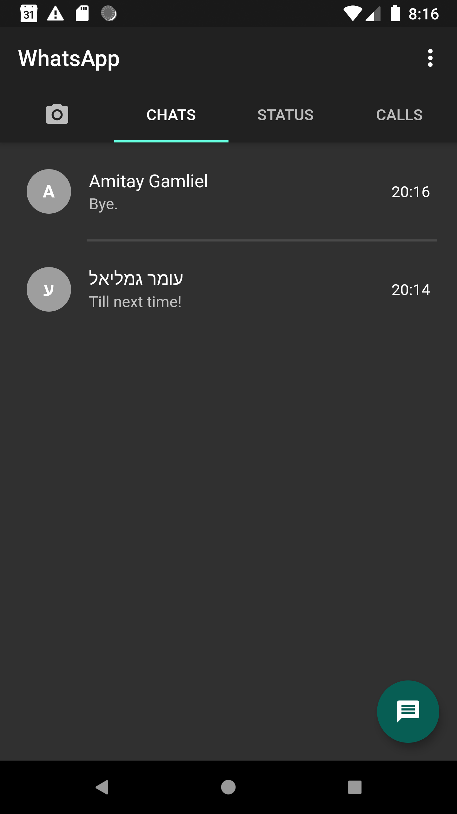
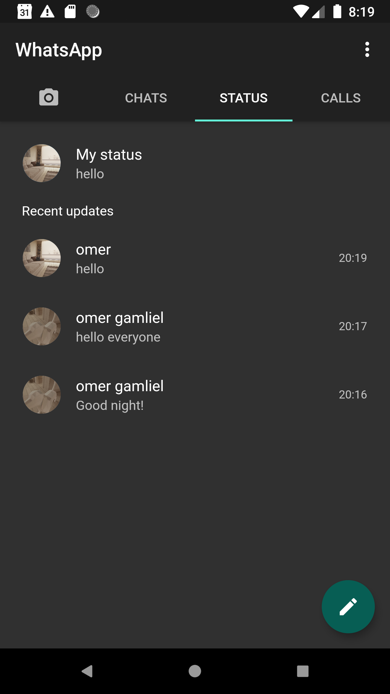
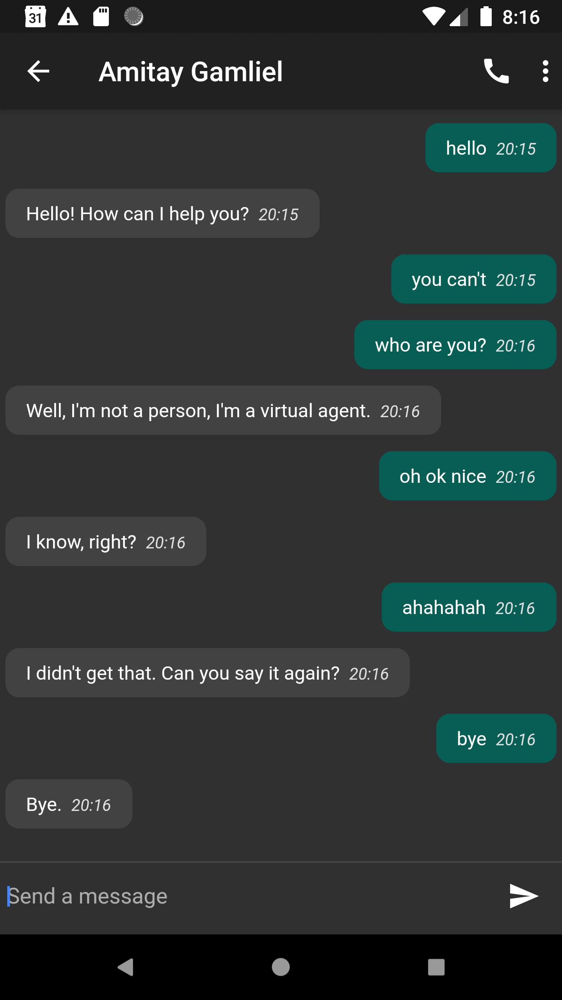

# WhatsAppClone

A clean mvvm styled architecture, whatsApp clone app.

This app is a mini-clone version of WhatsApp, build with Flutter. Real contacts replaced with DialogFlow API small-talk agents.

The main goal is to build readble, maintainable, testable, and high-quality flutter app using mvvm design pattern from the stacked package developed by [FilledStacks](https://www.filledstacks.com/).

You can learn how to use and implement the architecture here: https://www.youtube.com/playlist?list=PLdTodMosi-BwM4XkagNwe4KADOMWQS5X-

View layer (UI), viewmodel layer (business logic), and model layer (services, repos) are all seperated from each other. The view layer can only talks to the viewmodel. The model layer can only talks to the viewmodel layer. The viewmodel layer is the bridge between the layers, and can talks both view layer and model layer.

- Source files contains unit testing of each layer, and integration testing for verious app operations. 

## Screenshots

   
 

## Technologies
 
### Architecture
- **MVVM design pattern**

### Front-end
- **Flutter SDK**
- **[Stacked](https://pub.dev/packages/stacked), based on Provider** 

### Back-end
- **SQLite**
- **Firebase (Auth, Storage, Firestore, Functions, FCM)**
- **DialogFlow API (Google Cloud Platform)**

# Author 🙋

-   **Omer Gamliel** - [LinkedIn](https://www.linkedin.com/in/omer-gamliel-6a813a188/)
